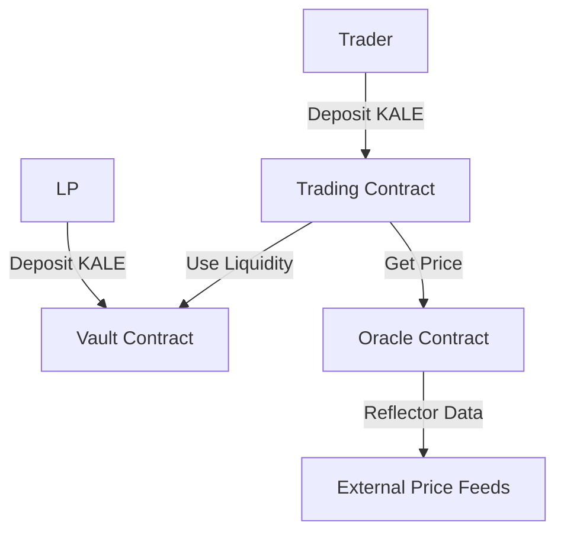

# KALE Perpetual Exchange

> A decentralized leveraged trading platform built on Stellar's Soroban smart contract platform, featuring KALE as the primary collateral asset.

[](https://soroban.stellar.org)
[](https://opensource.org/licenses/MIT)
[](https://stellar.expert/explorer/testnet)

## Table of Contents

- [Overview](#overview)
- [Architecture](#architecture)
- [Features](#features)
- [Getting Started](#getting-started)
- [Trading Mechanics](#trading-mechanics)
- [API Reference](#api-reference)
- [Deployment](#deployment)
- [Contributing](#contributing)

## Overview

KALE Perpetual Exchange is a sophisticated DeFi protocol that enables leveraged trading of digital assets using a pool-based market making model. Built on top of Zenex architecture, the platform uses standardized, tokenized vaults where each share represents proportional ownership of underlying assets.

### Key Benefits

- **Pool-based trading** - No order books, trade against vault liquidity
- **KALE collateral** - Native token integration with $1 USD peg
- **Stellar Passkeys** - Hardware-backed authentication without private keys
- **Up to 50x leverage** - Advanced margin system with automatic liquidations
- **Reflector oracles** - Tamper-resistant price feeds

## Architecture

### Core Smart Contracts

| Contract | Address | Description |
|----------|---------|-------------|
| **KALE Token** | `CAAVU2UQJLMZ3GUZFM56KVNHLPA3ZSSNR4VP2U53YBXFD2GI3QLIVHZZ` | ERC-20 compatible collateral token |
| **Oracle** | `CCQFLFIIP6VOTVWU3ENWZGRITY3UNAZT3SRPDF27JEAXNEVIGR3OA3IQ` | Reflector price feed integration |
| **Trading** | `CACR6U34NZEAROL7EEH22HHLEE6URKE43FB23CLLSOC3XZCMXUNM5Z2I` | Perpetual swap mechanics |
| **Vault** | `CCYALTIG7PMV7HSKXVWNBEKDCI6ED2N7SS2FNP322AIH35GFMVSMHWEG` | Liquidity pool management |
| **Share Token** | `CCPU63KOWDVITW442XCC6CBVMINZME4X2JD6IDAGNNS3ILRX7HVXVHBV` | Vault LP tokens |

### System Flow



## Features

### Advanced Leverage System

- **Initial Margin**: 1% (theoretical 100x leverage)
- **Maintenance Margin**: 0.5%
- **Maximum Leverage**: 50x (frontend enforced)
- **Automatic Liquidation**: Below maintenance threshold

### Dynamic Funding Rates

- Position skew balancing mechanism
- LPs earn funding rate premiums
- Market equilibrium maintenance

### Stellar Passkey Authentication

```typescript
// Example: Authenticate and trade
const authResult = await passkeyService.authenticate();
if (authResult.success) {
  const tradeResult = await passkeyService.executeTrade(
    'XLM',    // market
    true,     // isLong
    '100',    // amount
    10        // leverage
  );
}
```

## Getting Started

### Prerequisites

- Node.js 18+
- Modern browser with WebAuthn support
- Stellar CLI (for development)

### Installation

```bash
git clone https://github.com/KBenster/kale-perps
cd kale-perps
npm install
```

### Quick Start

```bash
# Start development server
npm run dev

# Open browser to http://localhost:3000
```

### Environment Setup

Create `.env.local`:

```env
PRIVATE_KEY=your_stellar_private_key_here
RPC_URL=https://soroban-testnet.stellar.org
NETWORK_PASSPHRASE=Test SDF Network ; September 2015
```

## Trading Mechanics

### Opening Positions

1. **Authenticate** with Stellar Passkey
2. **Select Asset** (XLM, BTC, ETH)
3. **Configure Trade**:
   - Position size
   - Leverage (1x - 50x)
   - Long/Short direction
4. **Execute** transaction on Stellar testnet

### Position Management

| Feature | Description |
|---------|-------------|
| Real-time PnL | Live profit/loss calculation |
| Liquidation Price | Dynamic threshold monitoring |
| Margin Ratio | Health indicator |
| One-click Close | Instant position exit |

### Vault Participation

```typescript
// Deposit KALE to earn LP rewards
const depositResult = await vaultContract.deposit(amount);

// Withdraw with proportional share
const withdrawResult = await vaultContract.withdraw(shares);
```

## API Reference

### Trading Contract

```rust
/// Create new leveraged position
pub fn create_position(
    trader: Address,
    asset: Asset,
    collateral: i128,
    notional_size: i128,
    is_long: bool,
    entry_price: i128
) -> Result<u32, Error>

/// Close existing position
pub fn close_position(
    trader: Address,
    position_id: u32
) -> Result<i128, Error>

/// Liquidate undercollateralized position
pub fn liquidate(
    liquidator: Address,
    trader: Address,
    position_id: u32
) -> Result<(), Error>
```

### Vault Contract

```rust
/// Deposit KALE for LP shares
pub fn deposit(user: Address, amount: i128) -> Result<i128, Error>

/// Withdraw KALE by burning shares
pub fn withdraw(user: Address, shares: i128) -> Result<i128, Error>

/// Get vault statistics
pub fn get_vault_info() -> VaultInfo
```

## Deployment

### Contract Deployment

```bash
# Deploy all contracts to testnet
npm run deploy
```

### Configuration

```json
{
  "network": "testnet",
  "xlmMarket": {
    "enabled": true,
    "maxPayout": "10.0",
    "minCollateral": "10.0",
    "maxCollateral": "1000000.0",
    "baseFee": "0.0005",
    "targetUtilization": "0.8"
  }
}
```

### Verification

Visit deployed contracts on [Stellar Expert](https://stellar.expert/explorer/testnet):
- [KALE Token](https://stellar.expert/explorer/testnet/contract/CAAVU2UQJLMZ3GUZFM56KVNHLPA3ZSSNR4VP2U53YBXFD2GI3QLIVHZZ)
- [Trading Contract](https://stellar.expert/explorer/testnet/contract/CACR6U34NZEAROL7EEH22HHLEE6URKE43FB23CLLSOC3XZCMXUNM5Z2I)

## Security

### Risk Management

- **Margin Requirements**: Enforced at contract level
- **Oracle Security**: Reflector integration with multiple data sources
- **Liquidation Incentives**: Encourages healthy position maintenance
- **Emergency Controls**: Pause functionality for critical issues

### User Security

- **Passkey Authentication**: Hardware-backed key storage
- **No Seed Phrases**: Eliminates key management burden
- **Biometric Signing**: Device-native transaction approval

## Roadmap

### Phase 1: Core Platform ✅
- [x] Smart contract deployment
- [x] Passkey integration
- [x] Basic trading interface
- [x] Vault functionality

### Phase 2: Enhanced Trading
- [ ] Multiple asset support
- [ ] Advanced order types
- [ ] Mobile application
- [ ] Analytics dashboard

### Phase 3: Ecosystem Expansion
- [ ] Options protocols
- [ ] Insurance pools
- [ ] Flash loan integration
- [ ] Cross-chain bridges

## Contributing

We welcome contributions! Please see our [Contributing Guide](CONTRIBUTING.md).

### Development Setup

```bash
# Install dependencies
npm install

# Run tests
npm test

# Start local development
npm run dev
```

### Submitting Changes

1. Fork the repository
2. Create feature branch (`git checkout -b feature/amazing-feature`)
3. Commit changes (`git commit -m 'Add amazing feature'`)
4. Push to branch (`git push origin feature/amazing-feature`)
5. Open Pull Request

## License

This project is licensed under the MIT License - see the [LICENSE](LICENSE) file for details.

## Links

- **Website**: [Coming Soon]
- **Documentation**: [Stellar Docs](https://soroban.stellar.org)
- **Explorer**: [Stellar Expert](https://stellar.expert/explorer/testnet)
- **Discord**: [Stellar Community](https://discord.gg/stellar)

## Acknowledgments

- **Stellar Foundation** - Soroban smart contract platform
- **Reflector** - Reliable oracle infrastructure
- **Zenith Protocols** - Core architecture and design

---

**Disclaimer**: This software is provided as-is for educational and development purposes. Use at your own risk on testnet only.
